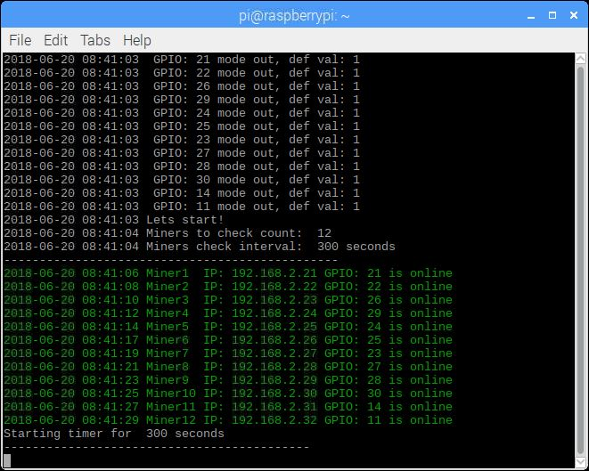
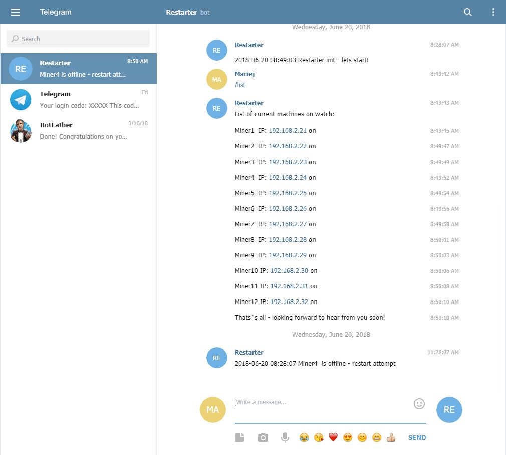

# ip-restarter

Simple Python program for auto-restarting computer(s) with Raspberry Pi from the GPIO pins.

### How-to
This application requires installation of the WiringPi module to support GPIO ports see below link.
```
gpio version >= 2.44
http://wiringpi.com/the-gpio-utility/
```
To simple run script use command
```
python restarter.py
```
Using ip-restarter as simple "system service" to avoid any app interuptions or system restarts might be done using screen. It is like a window manager for your console. It will allow you to keep multiple terminal sessions running and easily switch between them. It also protects you from disconnection, because the screen session doesn’t end when you get disconnected.
To run python script in screen please use command below.
```
screen -dmS restarter python ~/ip-restarter/restarter.py
```
Where "restarter" is an screen session name. Then you can connect to created screen session using command
```
screen -x restarter
```
To exit connected screen session without closing them you should use a combination of keyboard shortcuts like below.
```
CTRL+A CTRL+D
```
Because simple CTRL+Z or CTRL+X will close screen session.

### CRON Job Setup

There is also a bash script added by which you should be able to keep all things related to the restarter running all the time enabled in the case of the failure of the application itself or in the case of a system restart/crash. Bash script checks if the screen session is still running, if it does not then run the restarter script again. To perform such a simple monitoring of the restarter application, it is recommended to use CRON by adding an entry like below:
```
* * * * * ~/ip-restarter/cron.sh > /dev/null 2>&1
```
or if you prefer creating logs of the restarter operation
```
* * * * * ~/ip-restarter/cron.sh >> /var/log/restarter.log
```
Such an entry in the CRON file checks the correctness of the restarter application every minute.

### IP-Restarter SSH console preview


### IP-Restarter Telegram chat preview


#### Scripts are still in progress, but they are working fine
